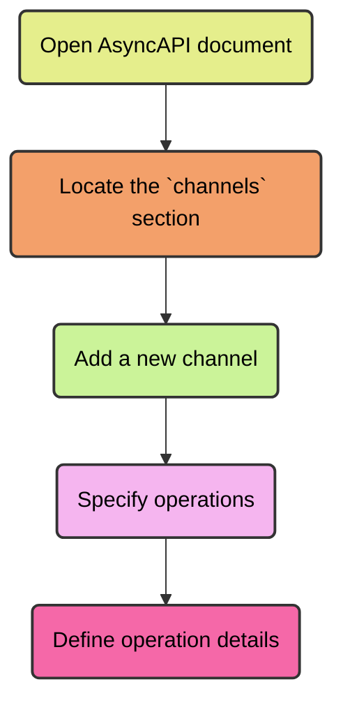

For adding operations to an AsyncAPI document, we need to define them within the channels section of the document. The step-by-step guide on how to add operations to an AsyncAPI document is as follows - 

- Open your AsyncAPI document in a text editor or an AsyncAPI editor tool.

- Locate the `channels` section in your AsyncAPI document. This section defines the messaging channels and their associated operations.

- Within the `channels` section, add a new channel using the desired channel name. Channels are represented as properties within the `channels` object, and their names are usually formatted as paths or topics, depending on the messaging protocol you are using (e.g. `/users/{userId}/notifications` or `user.notifications`).

- Inside the channel definition, specify the desired operations by creating sub-properties for each operation. Common operations include `publish`, `subscribe`, `publishSubscribe`, `requestReply`, and request.

- For each operation, define its details using the appropriate keywords and properties. These details include the operation type, payload schema, headers, bindings, and other relevant information.

Operations can be defined as an independent object in the AsyncAPI document. Operations have the following components for it's definition -

|  Field Name | Type | Description |
|---|---|---|
| title | string | An easy to understand headline about the operation |
| summary | string | A brief overview of the purpose of the operation |
| description | string | A detailed explanation of the operation |
| Channel | Reference Object Link | A `ref` pointer to the definition of the channel in which the operation is performed |
| Action | "send" or "receive" | Uses `send` when the application sends a message to the given channel, and uses `receive` when the application receives a message from the given channel |
| Tags | Tag Object | List of tags for logical grouping and categorization of operations |
| Bindings | Bindings Object | A map where keys store the name of protocol and the values store protocol-specific definitions for the operation |
| Traits | Traits Object | A list of traits to apply to the operation object. Traits must be merged using Traits Merge Mechanism. The resulting object should be a valid Operation Object |
